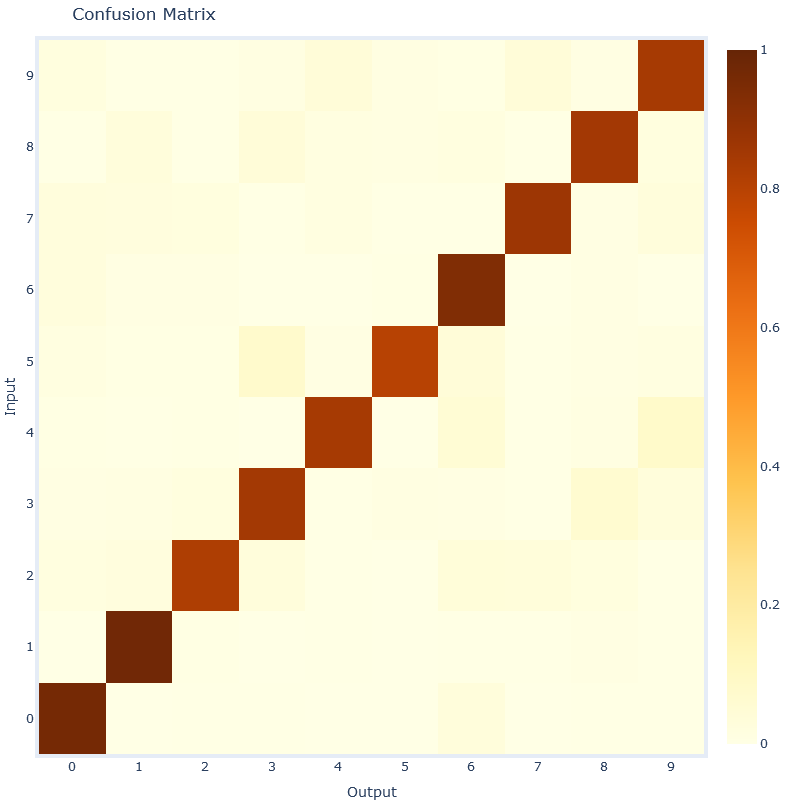

# My bachelor's thesis:

### Modeling of visual recognition based on spiking neural networks with a competition between local receptive fields

# Overview of the current state of my work

I work with unsupervised learning on MNIST of Spiking Neural Networks.

I've reproduced the results of this [paper](https://arxiv.org/abs/1904.06269) using the [bindsnet](https://github.com/Hananel-Hazan/bindsnet) library. It is important to read the paper for further understanding.

Currently I have trained 25- and 100-filter networks. Here is a figure with typical weights of a locally connected layer after 50000 iterations of training:

The overall accuracy of this network is 0.86. Here is the accuracy distribution between different labels:

And here is the confusion matrix:

I discovered, that statistically calculated votes (what I call the "calibration" of the network) give us the following votes distribution:

where by "vote" I call the level of certainty that a specific spiking neuron gives for a specific class. So on the figure above 1, ..., 10 means "best class for the neuron", "second best class for the neuron", .. , "worst class for the neuron".

In the paper I'm reproducing only the top3 classes are used in the voting mechanism. I discovered that using all classes can improve the accuracy a lot (around 5%). I'm currently in the process of finding the best parameters for the network, so my accuracy is slightly below best accuracy from the paper (92% for 100 filters).

# Work to do in the future

* Compare to a network with a convolution layer
* Introduce a training mechanism of the competition weights.