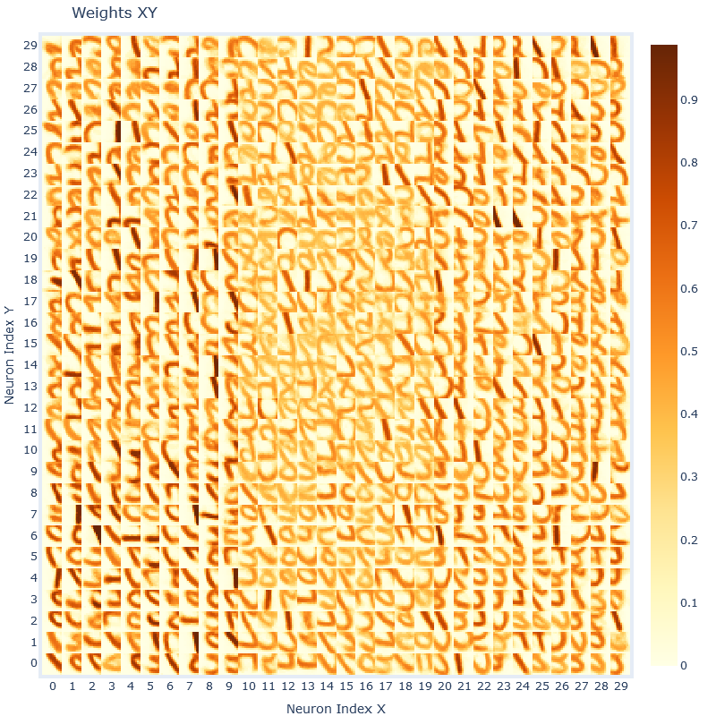
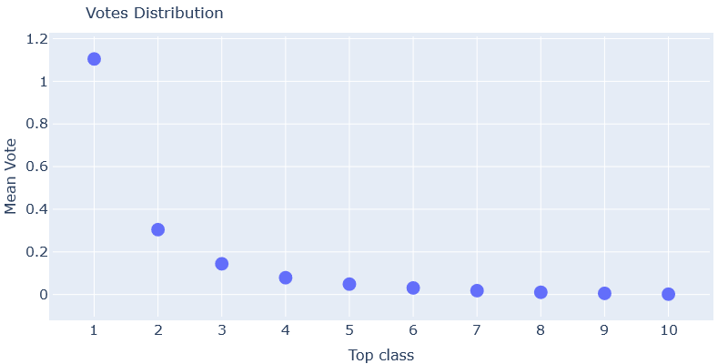
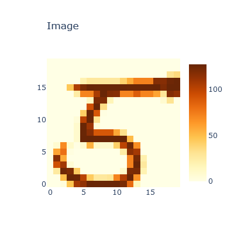

# My bachelor's thesis:

### Modeling of visual recognition based on spiking neural networks with a competition between local receptive fields

# Overview of the current state of my work

I work with unsupervised learning on MNIST of Spiking Neural Networks.

I've reproduced the results of this [paper](https://arxiv.org/abs/1904.06269) using the [bindsnet](https://github.com/Hananel-Hazan/bindsnet) library. It is important to read the paper for further understanding.

Currently I have trained 25- and 100-filter networks. Here is a figure with typical weights of a locally connected layer after 50000 iterations of training:



The overall accuracy of this network is 0.86. Here is the accuracy distribution between different labels:


And here is the confusion matrix:


I discovered, that statistically calculated votes (what I call the "calibration" of the network) give us the following votes distribution:



where by "vote" I call the level of certainty that a specific spiking neuron gives for a specific class. So on the figure above 1, ..., 10 means "best class for the neuron", "second best class for the neuron", .. , "worst class for the neuron".

In the paper I'm reproducing only the top3 classes are used in the voting mechanism. I discovered that using all classes can improve the accuracy a lot (around 5%). I'm currently in the process of finding the best parameters for the network, so my accuracy is slightly below best accuracy from the paper (92% for 100 filters).

# Work to do in the future

* Compare to a network with a convolution layer
* Introduce a training mechanism of the competition weights.

# Usage

Run the following code in Jupyter Notebook

## Basic imports

```python
from LC_SNN import LC_SNN, load_LC_SNN, view_database
```

To view current networks database use

```python
view_database()
```

Output:

| id                                                       | accuracy | n_iter | norm                | n_filters | c_w    | crop | kernel_size | stride | time_max | intensity |
| -------------------------------------------------------- | -------- | ------ | ------------------- | --------- | ------ | ---- | ----------- | ------ | -------- | --------- |
| 077029b0df623416d0640d0d400fada60a5997c9f1864dfe0ffc0848 | 0.8616   | 5000   | 0.24                | 100       | -50.0  | 20   | 12          | 4      | 250      | 127.5     |
| 10706382198294901892                                     | 0.7655   | 10000  | 0.49000000000000005 | 25        | -100.0 | 20   | 12          | 4      | 250      | 127.5     |
| 11078776799026513062                                     | 0.7694   | 10000  | 0.5                 | 25        | -100.0 | 20   | 12          | 4      | 250      | 127.5     |
| 11579302362096645865                                     | 0.7679   | 10000  | 0.40000000000000013 | 25        | -100.0 | 20   | 12          | 4      | 250      | 127.5     |
| 12b1568c093bf5563e169f4e864154d20b95cec6492c59e0e2295068 | 0.7443   | 10000  | 0.48                | 100       | -20.0  | 20   | 12          | 4      | 250      | 127.5     |
| 146895984239560197                                       | 0.7533   | 10000  | 0.5000000000000001  | 25        | -100.0 | 20   | 12          | 4      | 250      | 127.5     |

## Loading an existing network

Copy the id of a network you want to load.

```python
net = load_LC_SNN('077029b0df623416d0640d0d400fada60a5997c9f1864dfe0ffc0848')
```

Network loaded. Now you can check it's behavior:

```python
net.feed_class(5, plot=True)
```

Output:

Prediction: 5




## Training a new network

Run with desired parameters:

```python
net = LC_SNN(n_iter=5000)
```

You can set `n_iter` up to 60000, but 5000 will do just fine and save a lot of time.

Then to train the network (and be able so see the progress) run

```python
net.train(plot=True, debug=True)

net.calibrate()
```

The network is ready. To save the network:

```python
net.save()
```

To check network's accuracy, accuracy distribution, confusion matrix and votes distribution you can use:

```python
net.accuracy

net.accuracy_distribution()

net.confusion()

net.votes_distribution()
```

