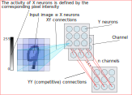
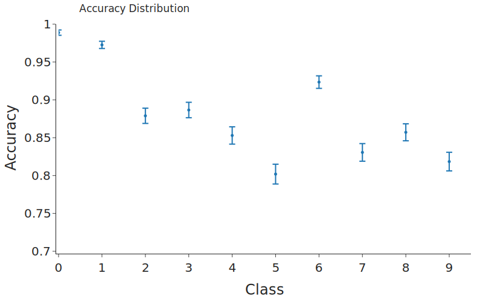

[](https://github.com/psf/black)

# Bachelor's thesis

**Modeling of visual recognition based on spiking neural networks with a competition between local receptive fields**

The text in Russian is located at `article/thesis.pdf`.

# Short overview

The main topic of this work is unsupervised learning of Spiking Neural Networks. We are using the standard MNIST images classification problem. All the modeling is made with the [bindsnet](https://github.com/Hananel-Hazan/bindsnet) library.

It is important to read this [paper](https://arxiv.org/abs/1904.06269), because we are working on improving the competitive connections from said paper. Therefore, we have two goals:

* Comparison of Locally Connected networks to Convolution and Fully Connected networks (with similar  number of parameters)

* Finding an efficient way of training inhibitor (competitive) connections; studying their influence on the overall accuracy.

   *Note that we don't have a goal of achieving maximum accuracy for this task.*

The networks in this work have an input layer (**X**) and one hidden layer (**Y**). **XY** connections architecture is either convolution or locally connected (we also test the fully connected architecture for a baseline). The network has **N** channels - equal groups of convolution or locally connected neurons. **Y** neurons with the same receptive fields also have competitive (inhibitor) connections between them.  



These connections are defined as a constant negative weight, but can be trained later. Lower are the results of the comparison between different network architectures. Mean values are presented, N = 5. Some of the lower accuracies might be for networks with sub-optimal hyperparameters. **Method 1** is the best voting algorithm, **method 2** is a linear classifier trained on **Y** neurons activity.

LCSNN = Locally Connected Spiking Neural Network, CSNN = Convolution Spiking Neural Network, FCSNN = Fully Connected Spiking Neural Network

| N    | **Architecture** | **Channels** | **Kernel** | **Parameters** | **Neurons** | **Accuracy with method 1** | **Accuracy with method 2** |
| ---- | ---------------- | ------------ | ---------- | -------------- | ----------- | -------------------------- | -------------------------- |
| 1    | LCSNN            | 1000         | 12         | 10287000       | 9000        | 92.3 ± 0.7                 | 95.1 ± 0.5                 |
| 2    | LCSNN            | 100          | 12         | 218700         | 900         | 87.5 ± 0.9                 | 91.5 ± 0.6                 |
| 3    | LCSNN            | 100          | 8          | 260800         | 1600        | 82.9 ± 0.6                 | 88.1 ± 0.7                 |
| 4    | **LCSNN***       | 25           | 12         | 37800          | 225         | 82.3 ± 1.0                 | 82.3 ± 0.6                 |
| 5    | LCSNN            | 25           | 12         | 37800          | 225         | 80.1 ± 1.0                 | 85.5 ± 0.8                 |
| 6    | LCSNN            | 25           | 8          | 35200          | 400         | 73.6 ± 1.0                 | 80.3 ± 0.7                 |
| 7    | CSNN             | 169          | 12         | 255672         | 1521        | 79.2 ± 1.6                 | 85.7 ± 1.4                 |
| 8    | CSNN             | 81           | 12         | 58464          | 729         | 77.2 ± 1.7                 | 83.1 ± 1.2                 |
| 9    | CSNN             | 100          | 8          | 158464         | 1600        | 77.4 ± 1.9                 | 82.1 ± 1.3                 |
| 10   | CSNN             | 25           | 12         | 5544           | 225         | 65.8 ± 0.7                 | 77.1 ± 0.6                 |
| 11   | CSNN             | 25           | 8          | 9664           | 400         | 63.1 ± 1.2                 | 75.8 ± 0.5                 |
| 12   | FCSNN            | 100          | 20         | 449100         | 100         | 81.4 ± 0.9                 | 82.1 ± 0.8                 |

**\*** network with trained competition connections

The table above shows that:

​	1) Locally Connected networks perform better than Convolution networks (for this specific task)

​	2) Training the competition connections can increase accuracy (rows 4 and 5)

A more accurate English text will be available soon as I'm working on the paper. The Russian version is located at `article/article.pdf`.

# Installation

To reproduce my results download this repository and install all required packages with [conda](https://www.anaconda.com/distribution/). You can change the name of the environment in the first line of the `environment.yml` file. The default name is bachelor_danielgafni.

```shell
conda env create -f environment.yml
```

# Usage

All my code is located in the **thesis** directory.

The **bindsnet** directory contains modified and corrected [bindsnet](https://github.com/Hananel-Hazan/bindsnet) package.

Pre-trained networks are located in the **networks** directory. Choose branch **no-networks** if you don't want them (~800 MB folder).

An example Jupyter Notebook can be found in the repository.

Run the following code in Jupyter Notebook. The notebook must be located at the root of the project.

```
activate bachelor_danielgafni
jupyter notebook
```

##  Basic imports

```python
from thesis.nets import *
from thesis.utils import *
```

To view available networks use

```python
view_database()
```

Output:

|      | name                                                     | accuracy | n_iter | mean_weight | n_filters |  c_w | crop | kernel_size | stride | time_max |  c_l |   dt |      error | intensity | kernel_prod | network_type | nu   | tau_neg | tau_pos |
| ---: | :------------------------------------------------------- | -------: | -----: | ----------: | --------: | ---: | ---: | ----------: | -----: | -------: | ---: | ---: | ---------: | --------: | ----------: | :----------- | :--- | -----: | ----: |
|    0 | 001c890e9fea37e5e6a85530f89ae9871548f6bb22ce6be82d0eb74d |    0.832 |   5000 |        0.22 |       100 |  -60 |   20 |          12 |      4 |      250 |    0 |    1 | 0.00442011 |     127.5 |         144 | LC_SNN       |      |     20 |    20 |
|    1 | 01d179e6813f1c54d8e97295259a257c5635f10ee22403b0b975c9ae |    0.869 |   5000 |        0.26 |       100 |  -50 |   20 |          12 |      4 |      250 |    0 |    1 | 0.00359991 |     127.5 |         144 | LC_SNN       |      |     20 |    20 |
|    2 | 028eb617028203a20f87b67b98bae7f812c9dda70e758af0b93ce6bd |    0.711 |   5000 |         0.2 |        25 | -100 |   20 |          12 |      4 |      250 |    0 |    1 | 0.00205479 |     127.5 |         144 | LC_SNN       |      |     20 |    20 |
|    3 | 0304916af971640b3e40ffef8f71d351ff0e4448e0d7ea260f129df2 |    0.755 |   5000 |         0.2 |        25 |  -40 |   20 |          12 |      4 |      250 |    0 |    1 | 0.00184975 |     127.5 |         144 | LC_SNN       |      |     20 |    20 |
|    4 | 03102554c240396be025c63900302eef01edd93792b022ef30cbf08f |    0.858 |   5000 |        0.34 |       100 |  -40 |   20 |          12 |      4 |      250 |    0 |    1 | 0.00385279 |     127.5 |         144 | LC_SNN       |      |     20 |    20 |

## Loading an existing network

Copy the name of a network you want to load.

```python
net = load_network('01d179e6813f1c54d8e97295259a257c5635f10ee22403b0b975c9ae')
```

Network loaded. Now you can check its behavior:

```python
net.feed_label(4, plot=True)
```

Output:

Prediction: 4


## Training a new network

Run with desired parameters:

```python
net = LC_SNN()  # C_SNN() to create a convolution network
```

c_l = True will make the competition weights trainable.

Then to train the network (and be able so see the progress) run

```python
net.train(n_iter=5000, plot=True, vis_interval=30)  # max is 50000, 5000 is fine 

net.calibrate(n_iter=5000)  # max is 10000, 5000 is fine

net.calculate_accuracy(n_iter=1000)  # max is 10000
```

To calibrate and calculate accuracy with a linear classifier add use .calibrate_lc() and .calculate_accuracy_lc()

The network is ready. To save the network:

```python
net.save()
```

To check network's accuracy, accuracy distribution, confusion matrix, and votes distribution you can use:

```python
accuracy = net.accuracy

accs, fig_accs = net.accuracy_distribution()
fig_accs.show()

fig_conf = net.confusion()
fig_conf.show()

fig_votes_distr = net.votes_distribution()
fig_votes_distr.show()
```

It is also possible to run the network over custom input images:

```python
net.feed_image('image.png')
```


## Deleting a network

```python
delete_network(net.name)
```

## If something goes wrong with the database

Delete `networks/networks.db` and run `thesis.utils.clean_database()`

# Some text from an older readme version

The following text is here just for some nice illustrations.

Locally Connected networks don't need a lot of training examples:


Here are 100-filter Locally Connected weights after 5000 iterations of training:


The overall accuracy of this network is 0.89. Here is the accuracy distribution between different labels:



And here is the confusion matrix:


Statistically calculated votes based on mean spiking activity of neurons for each label give us the following  distribution: 


On the figure above 1, ..., 10 means "best class for the neuron", "second best class for the neuron", .. , "worst class for the neuron".

In the paper I'm reproducing only the top3 classes are used in the voting mechanism. I am using all top10 classes, which a bit improves the accuracy and doesn't take much more time.


Here are the results of a gridsearch for Locally Connected networks with 100 filters performed over mean weight per Y neuron and competitive weight parameters:


and [interactive 3D plot](overview/gridsearch-LC_SNN.html) (download the file and open in your browser)

The results for 25 filters (Locally Connected network):


and [interactive 3D plot](overview/gridsearch-LC_SNN-25.html) 

And the results of gridsearch for 25 filters Convolution Networks:


and [interactive 3D plot](overview/gridsearch-C_SNN.html)