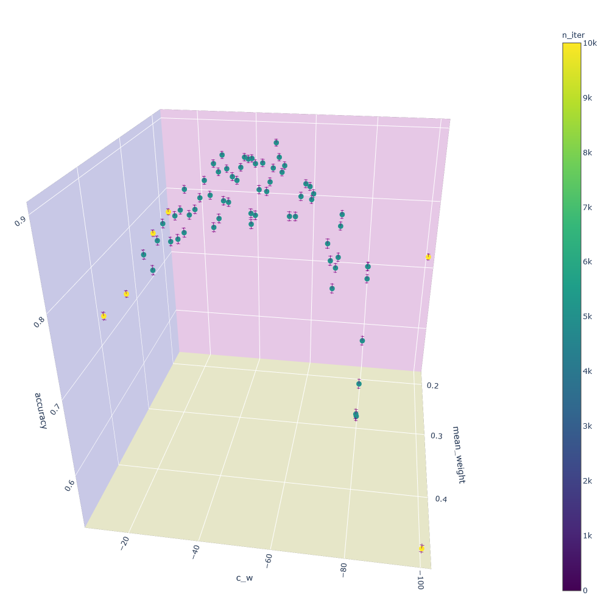

# My bachelor's thesis:

### Modeling of visual recognition based on spiking neural networks with a competition between local receptive fields

# Overview of the current state of my work

I work with unsupervised learning on MNIST of Spiking Neural Networks.

I've reproduced the results of this [paper](https://arxiv.org/abs/1904.06269) using the [bindsnet](https://github.com/Hananel-Hazan/bindsnet) library. It is important to read the paper for further understanding.

Currently I have trained 25- and 100-filter networks. The networks only have one hidden layer. Here is a figure with typical weights of this locally connected layer of 100 filters after 5000 iterations of training:


The overall accuracy of this network is 0.86. Here is the accuracy distribution between different labels:


And here is the confusion matrix:


Statistically calculated (based on spiking activity of neurons) give us the following "votes" distribution: 


where by "vote" I call the level of certainty that a specific spiking neuron gives for a specific class. So on the figure above 1, ..., 10 means "best class for the neuron", "second best class for the neuron", .. , "worst class for the neuron".

In the paper I'm reproducing only the top3 classes are used in the voting mechanism. I am using all top10 classes, which a bit improves the accuracy and doesn't take much more time. Here is a typical accuracy against top_n plot:


Here are the results of a gridsearch for Locally Connected networks with 100 filters performed over mean weight per Y neuron and competitive weight parameters:



and [interactive 3D plot](overview/gridsearch-LC_SNN.html) (download the file and open in your browser)

The results for 25 filters (Locally Connected network):


and [interactive 3D plot](overview/gridsearch-LC_SNN-25.html) 

And the results of gridsearch for 25 filters Convolution Networks:


and [interactive 3D plot](overview/gridsearch-C_SNN.html)

As the figures above show, Locally Connected networks can achieve around 14% better accuracy than Convolution Networks with the same number of filters. 

# Work to do

* Compare to a network with trainable competition weights. Right now I'm searching for good training parameters.

# Usage

To reproduce my results download this repository and install all required packages:

```
pip install -r requirements.txt
```

Install [bindsnet](https://github.com/Hananel-Hazan/bindsnet) and replace its directory with the one I provide. It contains important bugfixes.

All my code is located in the **thesis** directory.

Run the following code in Jupyter Notebook. The notebook must be located at the root of the project.

## Basic imports

```python
from thesis.nets import LC_SNN, C_SNN
from thesis.utils import view_database, load_network, delete_network
```

To view available networks use

```python
view_database()
```

Output:

| name                                                     | accuracy | n_iter | mean_weight         | n_filters | c_w    | crop | kernel_size | stride | time_max | intensity |
| -------------------------------------------------------- | -------- | ------ | ------------------- | --------- | ------ | ---- | ----------- | ------ | -------- | --------- |
| 077029b0df623416d0640d0d400fada60a5997c9f1864dfe0ffc0848 | 0.8616   | 5000   | 0.24                | 100       | -50.0  | 20   | 12          | 4      | 250      | 127.5     |
| 10706382198294901892                                     | 0.7655   | 10000  | 0.49000000000000005 | 25        | -100.0 | 20   | 12          | 4      | 250      | 127.5     |
| 11078776799026513062                                     | 0.7694   | 10000  | 0.5                 | 25        | -100.0 | 20   | 12          | 4      | 250      | 127.5     |
| 11579302362096645865                                     | 0.7679   | 10000  | 0.40000000000000013 | 25        | -100.0 | 20   | 12          | 4      | 250      | 127.5     |
| 12b1568c093bf5563e169f4e864154d20b95cec6492c59e0e2295068 | 0.7443   | 10000  | 0.48                | 100       | -20.0  | 20   | 12          | 4      | 250      | 127.5     |
| 146895984239560197                                       | 0.7533   | 10000  | 0.5000000000000001  | 25        | -100.0 | 20   | 12          | 4      | 250      | 127.5     |

## Loading an existing network

Copy the name of a network you want to load.

```python
net = load_network('077029b0df623416d0640d0d400fada60a5997c9f1864dfe0ffc0848')
```

Network loaded. Now you can check it's behavior:

```python
net.feed_class(5, plot=True)
```

Output:

Prediction: 5


## Training a new network

Run with desired parameters:

```python
net = LC_SNN()  # C_SNN() to create a convolution network
```

c_l = True will make the competition weights trainable.

Then to train the network (and be able so see the progress) run

```python
net.train(n_iter=5000, plot=True, vis_interval=30)  # max is 50000, 5000 is fine 

net.calibrate(n_iter=5000)  # max is 10000, 5000 is fine, again

net.calculate_accuracy(n_iter=1000)  # max is 10000
```

To calibrate and calculate accuracy with a linear classifier add use .calibrate_lc() and .calculate_accuracy_lc()

The network is ready. To save the network:

```python
net.save()
```

To check network's accuracy, accuracy distribution, confusion matrix, and votes distribution you can use:

```python
accuracy = net.accuracy

accs, fig_accs = net.accuracy_distribution()
fig_accs.show()

fig_conf = net.confusion()
fig_conf.show()

fig_votes_distr = net.votes_distribution()
fig_votes_distr.show()
```

It is also possible to run the network over custom input images:

```python
net.feed_image('image.png')
```


## Deleting a network

```python
delete_network(net.name)
```
